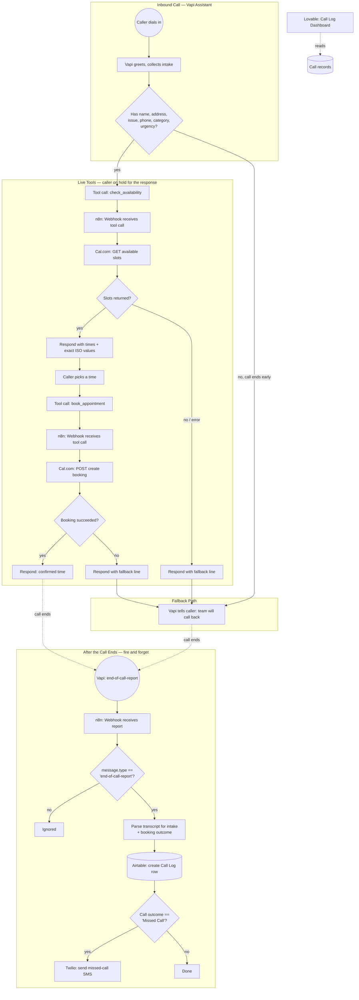

# Architecture

Three separate paths run on different timing, all tied to one Vapi
assistant. See [README.md](README.md) for setup and troubleshooting, and
[vapi-assistant-config.md](vapi-assistant-config.md) for the full system
prompt and tool definitions.

## Why live tool calls instead of a callback link

`check_availability` and `book_appointment` run *while the caller is still
on the phone*, not as a follow-up text with a booking link. That's a
deliberate scope decision (see the README's "Why this calls Cal.com live"
section) — it means the agent has to hold state across two sequential tool
calls in one conversation, survive a slot becoming unavailable mid-call,
and never leave the caller in dead air while an API round-trip is in
flight. The `request-start` filler message on each tool ("One moment, let
me check our availability") exists specifically to cover that gap.

## Why the post-call webhook is filtered by message type

Vapi's Server URL receives every lifecycle event during a call by
default, not just the final report — transcript updates, status changes,
speech events, a dozen-plus messages per call. The `IF: Is End-of-Call
Report` node right after the webhook checks `message.type ==
'end-of-call-report'` and drops everything else. Without it, every one of
those in-call events would trigger a full Airtable-write attempt, which is
exactly what happened during testing before this filter was added (see
the README's troubleshooting notes). Restricting Vapi's own **Server
Messages** setting to just `end-of-call-report` closes this at the source
too; the filter node is the backup, not the only defense.

## Why the post-call parse and the live tools don't share code

`check_availability` and `book_appointment` each format their own
response for the AI to speak. The post-call parser reads the *entire*
call transcript after the fact and reconstructs what happened from the
tool-call arguments embedded in it — a different extraction problem, since
by the time it runs, the call is already over and nothing can be asked
again. That's also why intake details (name, address, issue) are only
reliably captured for calls that reach `check_availability`: that's the
one place in the whole conversation where the full intake gets stated as
structured arguments instead of only appearing in free-text speech.
